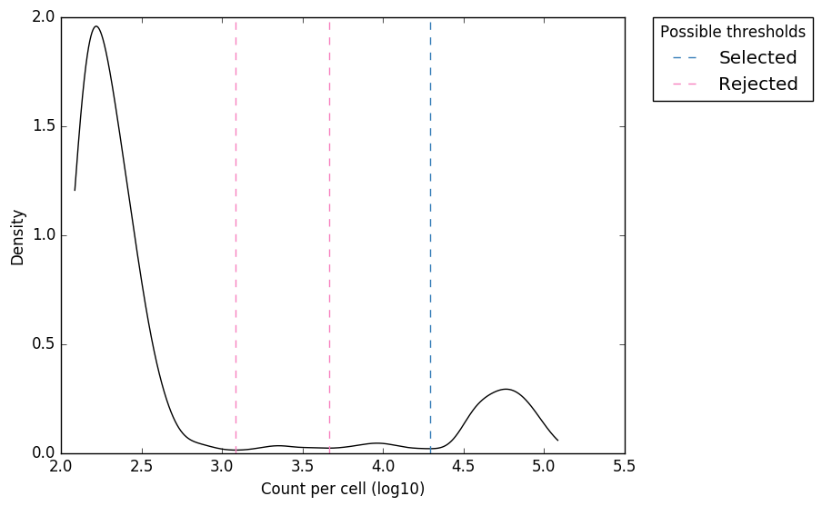
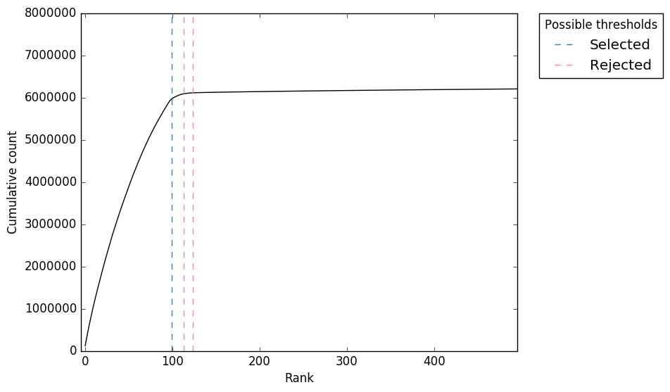
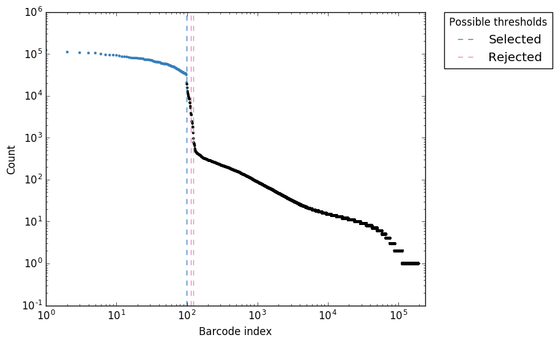

Single cell tutorial
====================

**Important update**: We now recommend the use of `alevin` for droplet-based
scRNA-Seq (e.g 10X, inDrop etc). `alevin` extends the directional
method used in `UMI-tools` to correct UMI errors with droplet
scRNA-Seq within a framework that also enables quantification using
multi-mapped reads. `alevin` is an accurate, fast and convenient
end-to-end tool to go from fastq -> count matrix. See
[alevin documentation](https://salmon.readthedocs.io/en/latest/alevin.html)
and [alevin pre-print](https://www.biorxiv.org/content/10.1101/335000v2) for more information

This tutorial will go through an end to end analysis for single cell analysis using UMI-tools. Before you start, you will need:
*  An installed copy of UMI-tools (see the installation guide)
*  [The STAR aligner](https://github.com/alexdobin/STAR)
*  A STAR index for the human genome
*  A transcriptome annotation. 
*  The [Subread package](http://subread.sourceforge.net/), version 1.5.3 or greater.
       
This tutorial will use an example dataset generated by 10X Genomics on their Chromium platform. At the end of the tutorial we cover variations on this workflow. We will continue to expand this section and cover other other data types here as well. 

With 4 cores at your disposal, the whole thing should be do-able in less than an hour for this dataset. 

The below assumes you are working in a linux environment. Some changes might be necessary if you are working in OSX, notably `wget` should be replace with `curl -O`

Outline of the process:


| Step | Inputs | Output |
| -------- | -------- | -------- |
| Find Cell barcode whitelist    | Read 1 fastq     | whitelist.txt     |
| Extract CB/UMIs and filter CBs | R1 + R2 fastqs + whitelist.txt | extracted fastqs |
| Map reads | extracted fastqs  | BAM |
| Assign reads to genes | BAM + transcriptome GTF | BAM
| Count unique reads per genes per cell | BAM | Counts.txt

TL;DR
-----
```bash
#! /bin/env bash
# Step 1: get data
wget http://cf.10xgenomics.com/samples/cell-exp/1.3.0/hgmm_100/hgmm_100_fastqs.tar;
tar -xf hgmm_100_fastqs.tar;
cat fastqs/hgmm_100_S1_L00?_R1_001.fastq.gz > hgmm_100_R1.fastq.gz;
cat fastqs/hgmm_100_S1_L00?_R2_001.fastq.gz > hgmm_100_R2.fastq.gz;

# Step 2: Identify correct cell barcodes
umi_tools whitelist --stdin hgmm_100_R1.fastq.gz \
                    --bc-pattern=CCCCCCCCCCCCCCCCNNNNNNNNNN \
                    --set-cell-number=100 \
                    --log2stderr > whitelist.txt;
                    
# Step 3: Extract barcdoes and UMIs and add to read names
umi_tools extract --bc-pattern=CCCCCCCCCCCCCCCCNNNNNNNNNN \
                  --stdin hgmm_100_R1.fastq.gz \
                  --stdout hgmm_100_R1_extracted.fastq.gz \
                  --read2-in hgmm_100_R2.fastq.gz \
                  --read2-out=hgmm_100_R2_extracted.fastq.gz \
                  --whitelist=whitelist.txt; 
# Step 4: Map reads
STAR --runThreadN 4 \
     --genomeDir hg38_noalt_junc85_99.dir \
     --readFilesIn hgmm_100_R2_extracted.fastq.gz \
     --readFilesCommand zcat \
     --outFilterMultimapNmax 1 \
     --outSAMtype BAM SortedByCoordinate;
     
# Step 5: Assign reads to genes
featureCounts -a geneset.gtf \
              -o gene_assigned \
              -R BAM Aligned.sortedByCoord.out.bam \
              -T 4;            
samtools sort Aligned.sortedByCoord.out.bam.featureCounts.bam -o assigned_sorted.bam;
samtools index assigned_sorted.bam;
              
# Step 6: Count UMIs per gene per cell
umi_tools count --per-gene --gene-tag=XT --assigned-status-tag=XS --per-cell -I assigned_sorted.bam -S counts.tsv.gz
            
```

Step 1: Obtaining the data
--------------------------
The dataset was produced from around 100 cells from a mixture of human and mouse cells. The download is 760MB, so make sure you've got space. It can be downloaded thus:

```
$ wget http://cf.10xgenomics.com/samples/cell-exp/1.3.0/hgmm_100/hgmm_100_fastqs.tar
$ tar -x hgmm_100_fastqs.tar
```

out of the archive you will get a directory called `fastqs` that will contain data from 8 sequencing lanes, with three files for each lane: a read 1 file, a read 2 file and file containing the Sample Barcodes. We are not interested in the sample barcodes files, but for the read 1 and read2 files, we need to combine the eight lanes into one. By the magic of gzip, we can do with `cat`:

    $ cat fastqs/hgmm_100_S1_L00?_R1_001.fastq.gz > hgmm_100_R1.fastq.gz
    $ cat fastqs/hgmm_100_S1_L00?_R2_001.fastq.gz > hgmm_100_R2.fastq.gz


If we look at the content of of the files we will see that the first read in the pair contains 26nt, which correspond to a 16nt Cell barcode (CB) and 10nt the Unique Molecular Identifier (UMI):


    $ zcat hgmm_100_R1.fastq.gz | head -n2
    @ST-K00126:308:HFLYFBBXX:1:1101:25834:1173 1:N:0:NACCACCA
    NGGGTCAGTCTAGTGTGGCGATTCAC
    +
    #AAFFJJJJJJJJJJJJJJJJJJJJJ

    -------CB-------|---UMI---
                     
We will need to remember this for the next two steps

Step 2: Identifying the real cells
---------------------------------

Cell barcodes are short nucleotide sequences, very much like UMIs, except instead of identifying independent molecules, they identify independent cells. We generally observe more of them in an experiment than there were cells. This could be for several reasons, including sequencing or PCR errors and the sequencing of empty droplets or those containing contaminants. Thus we must identify which cell barcodes we wish to use downstream. UMI-Tools `whitelist` command is used to produce a list of CB to use downstream. 

`whitelist` currently allows the common method of taking the top X most abundant barcodes. X can be estimated automatically from the data using the `knee` method (for more detail see this [blog post](https://cgatoxford.wordpress.com/2017/05/18/estimating-the-number-of-true-cell-barcodes-in-single-cell-rna-seq/)). However, it is just an estimate and for this data we've been told that there were 100 cells, so we can just supply that number (see variations section for performing the estimation for data sets where cell number is unknown).
 
     umi_tools whitelist --stdin hgmm_100_R1.fastq.gz \
                         --bc-pattern=CCCCCCCCCCCCCCCCNNNNNNNNNN \
                         --set-cell-number=100 \
                         --log2stderr > whitelist.txt

A couple of things about this command: 

### Input files
Firstly, note that FASTQ file that contains the barcodes is passed to  `--stdin`, this tells `whitelist` to read the data from this file rather than from stdin. This of course means you could pass data using standard pipes. 

### Plots
The `--plot-prefix` option tells `whitelist` to output summary plots for the frequency of each CB. We always recommend running with this option in order to visualise whether the number of cells accepted seems reasonable. See [Variations](Automatic estimation of cell number) for a more complete explanation of what these plots show.

### Specifying barcode locations
Second, the `--bc-pattern`. This tells `whitelist` where to find the CB and UMI in the read sequence. By default we assume the barcodes are at the 5' end of the read (this can be changed with `--3prime`). We then use `C` characters to show where CB bases are and `N` characters to show were UMI bases are. Thus, in the above we have 16 `C`s followed by 10 `N`s to denote that the first 16 bases of the read are CB bases and the second 16 are UMI bases. Alternatively, you can also define the barcode pattern using a regex instead (--extract-method=regex) in which there are named groups to define the positions for the cell barcode and UMI. For example we would change the above command to:
    
    umi_tools whitelist --stdin hgmm_100_R1.fastq.gz \
                        --bc-pattern='(?P<cell_1>.{16})(?P<umi_1>.{10})' \
                        --extract-method=regex \
                        --set-cell-number=100 \
                        --log2stderr > whitelist.txt
                        

         
This interface is very powerful and flexible and allows for the specification of all sorts of interesting things, like variable length CBs (UMIs do have to be a fixed length) and tolerant linker sequences (see the inDrop example in [Variations](#Barcode-extraction-for-inDrop) and `umi_tools whitelist --help`).

### Specifying outputs

By default UMI-tools outputs everything, final output, logging info and progress report, to the standard out pipe. Downstream sections will take this output just fine, but you might want to put the log somewhere else, like a separate file, or on the terminal. This can be achieved in one of several ways:

* You could redirect the final output using the `--stdout` or `-S` options. The final output will be directed to a file and the log will continue to come on stdout.
* You could redirect the log to a file with `--stdlog` or `-L`. The log and progress will be saved to a file and the final output sent to the standard out.
* You can redirect the log and progress to the standard err using `--log2stderr` as above. 
* You can switch off the log/progress with `-v 0`

This applies to all the UMI-Tools commands. 

### Using UMI counts rather than read counts in umi_tools whitelist
Many published protocols rank CBs by the number of reads the CBs appear in. However you could also use the number of unique UMIs a CB is associated with. Note that this is still an approximation to the number of transcripts captured because the same UMI could be associated with two different transcripts and be counted as independent. Activate this with `--method=umis`.

### Contents of `whitelist.txt`

The output of the whitelist command is a table containing the accepted CBs. It has four columns: 
1. The accepted CB
2. Comma separated list of other CBs within an edit distance of the CB in columns 1 and >1 edit away from any other accepted CB.
3. The abundance (read or UMI count) of the accepted.
4. Comma separated list of abundances for the CBs in column 2

e.g:

```
$ head whitelist.txt 
AAAGATGAGAAACGAG	AAAAATGAGAAACGAG,AAACATGAGAAACGAG,...	53122	4,6,...
AAAGCAAGTACCTACA	AAAACAAGTACCTACA,AAACCAAGTACCTACA,...	36255	2,3,...
AACACGTCAGCGTAAG	AAAACGTCAGCGTAAG,AACAAGTCAGCGTAAG,...	53133	4,11,...
```
(I have truncated columns 2 and 4 for easy viewing)

As we asked for 100 cells, this file should contain 100 lines:

```
$ wc -l whitelist.txt 
100 whitelist.txt
```

Step 3: Extract the barcodes and filter the reads
-------------------------------------------------

The next step is to extract the CB and UMI from Read 1 and add it to the Read 2 read name. We will also filter out reads that do not match one of the accepted cell barcode. 

The most basic form of this is executed with:

```
umi_tools extract --bc-pattern=CCCCCCCCCCCCCCCCNNNNNNNNNN \
                  --stdin hgmm_100_R1.fastq.gz \
                  --stdout hgmm_100_R1_extracted.fastq.gz \
                  --read2-in hgmm_100_R2.fastq.gz \
                  --read2-out=hgmm_100_R2_extracted.fastq.gz \
                  --whitelist=whitelist.txt 
```

The `--bc-pattern` and `--stdin` options are as before. Note that we send the standard out (which contains the extract Read 1s) to the a file (add `.gz` to the end of the name will trigger automatic compression). `--read2-in` and `--read2-out` specify the output files for read 2. Finally `--whitelist` passes the list of accepted CBs generated in the previous step and tells `extract` to only output those reads that contain accepted CBs. 

As the end of the log makes clear, the command above took about 20 minutes

```
2017-08-10 16:29:45,449 INFO Parsed 7100000 reads
2017-08-10 16:30:01,896 INFO Input Reads: 7197662
2017-08-10 16:30:01,896 INFO Reads output: 5963891
2017-08-10 16:30:01,896 INFO Filtered cell barcode: 1233771
# job finished in 1175 seconds at Thu Aug 10 16:30:01 2017 -- 1153.42 24.13  0.00  0.00 -- f5227f66-4f36-4862-9c7a-87caf3f81870
```

There should now be two output files in your directory: `hgmm_100_R1_extracted.fastq.gz` and `hgmm_100_R2_extracted.fastq.gz`. Looking at the first read we see:

```
$ zcat hgmm_100_R1_extracted.fastq.gz | head -n4
@ST-K00126:308:HFLYFBBXX:1:1101:31345:1261_AACTCTTGTTCTGAAC_CGGTTGGGAT 1:N:0:NACCACCA

+
```

The reads are now empty because the CBs and UMIs have now been moved from the read sequence to the read name, and there is nothing left. We will not need this file again.

If we look at the Read 2:

```
$ zcat hgmm_100_R2_extracted.fastq.gz | head -n4
@ST-K00126:308:HFLYFBBXX:1:1101:31345:1261_AACTCTTGTTCTGAAC_CGGTTGGGAT 2:N:0:NACCACCA
CCTTTTTGGAACCAACAATAGCAGCTCCATTTCTGGAGTCTGGGTCTTCCGAGGCCAGGAGCTCGCCTTTCCGCCGAGCCCAGATTGGCAGGTGGACT
+
A<<AFAFFFJJJJFJJJFA<7<FJF-AAJF7-FFF<FA7AFFFJ-77<JJFFFJJJJFAJFJ7-7AJ-7-FJJJ--)7-77F-F--AAAJAA-7-7F7
```

We can see that the CB and UMI from read 1 has been added to the name of read 2 as well. 

These reads are now ready to map!


### Discarding read 1
There are many single cell RNA-Seq techniques where read 1 only contains barcodes, as above. If we only want to write out the extracted read 2 file we can supply the `--read2-stdout` option to output read 2 on the stdout and discard read 1.


Step 4: Mapping reads
---------------------

At this point there are two different ways we might proceed. We could map to the transcriptome, where each each contig represents a different transcript. Alternatively we could map to the genome and then assign reads to genes. While transcriptome mapping allows for easier downstream analysis, we recommend mapping to the genome because it doesn't force reads to map to transcripts when a better match outside an annotated gene exists. However, there are cases when transcriptome mapping should be favoured, and we discuss this in the [Variations](#Mapping-to-the-transcriptome-rather-than-genome) section. 

We are going to use STAR here as our mapper, but you can substitute whichever splice-aware aligner you prefer. We are mapping to an index built on the human NCBI38 reference, with the alternate contigs removed (referred to by NCBI as the "analysis read set") using junctions from ENSEMBL85 and a 99nt overhang. We do not allow multimapping reads. 

```bash
$ STAR --runThreadN 4 \
       --genomeDir hg38_noalt_junc85_99.dir \
       --readFilesIn hgmm_100_R2_extracted.fastq.gz \
       --readFilesCommand zcat \
       --outFilterMultimapNmax 1 \
       --outSAMtype BAM SortedByCoordinate
```

If we have a look at the stats for this, we will see that 63.02% of reads mapped (depending on exactly how you've built your STAR index you may get a slightly different number). For 8.1% of these this is because of mapping to more than one location. The rest is probably because the sample contains both mouse and human cells, but we are only aligning to the human genome. In fact, given that, the mapping rate looks a bit on the high side: we are probably mapping some reads to the human genome that actually came from the mouse genome. Ideally we would perform this mapping using references that combined both the mouse and human genomes/transcriptomes. 

On our systems, using 4 threads, this mapping takes about 7 minutes. 

Step 5: Assigning reads to genes
--------------------------

Many of the single cell techniques that use UMIs are 3' tag count methods. This is important because it means that the UMIs are generally added before PCR and then fragmentation. This means that two reads from the same gene might have different mapping locations and still represent duplicates, as long as they come from the same gene. Therefore, UMI-tools need to know which gene each read came from. When reads are aligned to the transcriptome, this is easy as it is given by the contig (and possibly a gene to transcript look up table). However, with a genome alignment we need to assign reads to genes. 

We can do this with the `featureCounts` tool from the `subread` package. As well as outputting a table of (undeduplicated) counts, we can also instruct `featureCounts` to output a BAM with a new tag containing the identity of any gene the read maps to. 

**warning**: This only works on featureCounts from subread 1.5.3 and above, which was released July 2017. If you already have subread it could well need updating


You will need a geneset to assign genes to. Here ours is called `geneset.gtf`. It is the same geneset used to generate the mapping index above, and is based on the GENCODE annotations. 

```
$ featureCounts -a geneset.gtf -o gene_assigned -R BAM Aligned.sortedByCoord.out.bam -T 4

```

Unfortunately the BAM output by featureCounts is no longer sorted, so we now need to sort the BAM.

```
$ samtools sort Aligned.sortedByCoord.out.bam.featureCounts.bam -o assigned_sorted.bam
$ samtools index assigned_sorted.bam
```

We now have a sorted, indexed set of alignments assigned to the appropriate genes and we can now count the number of distinct UMIs mapping to each gene in each cell.

Step 6: Counting molecules
-------------------------

We are finally ready to process the UMIs aligned to each gene in each cell to find the number of distinct, error corrected UMIs mapping to each gene. 

```
$ umi_tools count --per-gene --gene-tag=XT --assigned-status-tag=XS --per-cell -I assigned_sorted.bam -S counts.tsv.gz
```

Since we want to count the number of UMIs per gene, and the gene assignment is encoded in the XT tag, we use the `--per-gene --gene-tag=XT` options. FeatureCounts also uses the XS tag to describe the gene assignment so we use the `--assigned-status-tag=XS` option. Any reads with an assignment matching `^[__|Unassigned]` (default value for `--skip-tags-regex`) will be skipped. `--per-cell` tells UMI-tools to also consider the CB and produce a separate count for each cell. The counts are output in a table with three columns: the gene_id, the cell barcode and the count of deduplicated UMIs. 

Running this command on this input takes 72 seconds on our system. 

```$ zcat counts.tsv.gz | head
$ zcat counts.tsv.gz | head
gene	cell	count
ENSG00000000003	AAAGATGAGAAACGAG	3
ENSG00000000003	AACTCTTGTTCTGAAC	4
ENSG00000000003	ACACCGGGTACGACCC	2
ENSG00000000003	ACACTGAGTCGGGTCT	5
ENSG00000000003	ACTATCTCAAGGTGTG	2
ENSG00000000003	ACTGTCCCATATGGTC	11
ENSG00000000003	ACTGTCCTCATGCTCC	5
ENSG00000000003	AGAGCTTCACGACGAA	2
ENSG00000000003	AGCGGTCTCGATAGAA	2
```

If you'd rather have this as a matrix, which each cell as a sepearte column, you can specify `--wide-format-cell-counts`. You can also output deduplicated reads using the `dedup` command in place of `count`. You can even output all reads, with each assigned to an UMI group, using the `group` command, although see below for some important points.

Time and memory for larger data sets
-------------------------------------

While the above was pretty quick, 7 million reads over 100 cells is a pretty tiny dataset. The most memory intensive part was the `STAR` alignment, and this is unlikely to change with larger datasets. Below we provide some figures for larger datasets. These times will obviously vary depending on your setup, in particular many of these tasks are I/O bound, and the nature of your storage will make a big difference. Running on local storage, particularly if its SSD, will probably give substantially quicker performance. Conversely if storage is accessed over standard network connections, it will probably be much slower. 


| Step | 10X 100 cells | 10X 1,000 cells |
| -------- | -------- | -------- |
| Whitelist     | 00:02* / 125Mb     | 00:21 / 261 Mb    |
| Extract | 00:10 96Mb  | 03:33* / 100 Mb   |
| Mapping | 00:05 / 17Gb | 00:23 / 17Gb |
| Assigning reads | 00:01 / 203 Mb | 00:04 / 137 Mb | 
| Sorting/Indexing | 00:01 / 809Mb** | 00:12 / 830Mb** |
| Counting | 00:02 / 203 Mb | 00:09 / 1.1Gb*** |

  \* Much of this time is spent compressing the output. Outputting to uncompressed files is significantly faster.
  
  \** memory used by `samtools sort` can be specified with the `-m` option. 

  \*** memory used counting is significaitonly reduced by mapping to the transcriptome rather than the genome. 
  
Variations
----------

### Barcode extraction for Drop-seq
For [Drop-seq](2), the current protocol includes a 12bp CB, followed by an 8bp UMI. We can therefore extract the barcodes using the following options:

```
--extract-method=string
--bc-pattern=CCCCCCCCCCCCNNNNNNNN
```

### Barcode extraction for inDrop
The CBs for [inDrop](1) are different lengths. Thus, we must use `--extract-method=regex` since we can no longer encode the barcode pattern in a simple string. If we look at the sequence of an inDrop read 1, we can demark the barcodes as follows:

```
TGAACATCTATGAGTGATTGCTTGTGACGCCTTGAGCCCATCCTGCTTTTTTTTT
---CB-1---|------ADAPTER--------|--CB-2-|-UMI-|poly(T)
```
The CB is split into two halves. CB-1 can be 8-12bp, the adapter sequence is always "GAGTGATTGCTTGTGACGCCTT", CB-2 is 8bp, UMI is 6bp and the read ends in a poly(T) seqeunce. In the case above, the barcode sequences are:

CB-1: TGAACATCTAT
CB-2: GAGCCCAT
CB (CB-1 + CB-2): TGAACATCTATGAGCCCAT
UMI: CCTGCT

To encode this in the barcode pattern, we must provide the option `--extract-method=regex` and provide `--bc-pattern` with a regex with groups named accordingly. Each group must have a integer suffix:
`--bc-pattern="(?P<cell_1>.{8,12})(?P<discard_1>GAGTGATTGCTTGTGACGCCTT)(?P<cell_2>.{8})(?P<umi_1>.{6})T{3}.*"`

This translates to: 8-12 characters (group="cell_1"), followed by "GAGTGATTGCTTGTGACGCCTT" (group="discard_1"), followed by 8 characters (group="cell_2"), followed by 6 characters (group="umi_1"), followed by 3 or more "T"s.

The other benefit of using a regex is that we can perform ['fuzzy'](https://pypi.python.org/pypi/regex/). For example, the inDrop adapter sequence is 22bp long so it may sometimes contain base calling errors. We can allow usp to two substituions like so:

`--bc-pattern="(?P<cell_1>.{8,12})(?P<discard_1>GAGTGATTGCTTGTGACGCCTT){s<=2}(?P<cell_2>.{8})(?P<umi_1>.{6})T{3}.*"`

It should be possible to encode any conceivable pattern of barcodes using a regex.

### Automatic estimation of cell number
In [Step 2](#Step-2:-Identifying-the-real-cells) above, we generated a whitelist of accepted ("true") CBs and provided the option `--set-cell-number=100` since we a prior belief about the number of cells we had sequenced. However, what if we didn't know how many cells we had actually sequenced? Well, in that case, we can leave out the `--set-cell-number` option and let `whitelist` estimate the number of true CBs automatically. Even better, if we have an estimate on the number of cells we have input into the system and we know the capture rate is at least 10% (this assumption holds true for inDrop and 10X Chromium platforms), we can provide the estimated number of input cells as an upper limit on the number of true CBs using the `--expect-cells` option. So, imagine with our experiment above, we estimated that around 200 cells were input into the system, we can generate the whitelist with the following command:


     umi_tools whitelist --stdin hgmm_100_R1.fastq.gz \
                         --bc-pattern=CCCCCCCCCCCCCCCCNNNNNNNNNN \
                         --expect-cells=200 \
                         --plot-prefix=expect_whitelist \
                         --log2stderr > whitelist.txt

We can check how many CBs we accepted:

```
$ wc -l whitelist.txt 
119 whitelist.txt
```

Based on our prior knowledge that there were ~100 true CBs, we've probably slightly over-estimated the number of CBs here. We can visualise this by looking at the following plots which present the same data in different ways to help assess the threshold:


Figure 1. "expect_whitelist_cell_barcode_counts_density.png" 
Distribution of read counts per CB. The least abundant CBs are removed from this plot

---



Figure 2. "expect_whitelist_cell_barcode_knee.png"
Cumulative counts as number of accepted barcodes is increased

---



Figure 3. "expect_whitelist_cell_barcode_counts.png"
Logs counts per barcode (ranked)

---


For all plots, the 'Selected' local minima (or threshold) is shown by the dashed line. If we had other local minima which were 'Rejected' these would also be shown. The thresholds are also tabulated in the file `expect_whitelist_cell_thresholds.tsv`.

In Figure 1, we can see two clear peaks, with the right peak representing the true cell barcodes.  In this case, the selected local minima appears to be in the correct place. This is confirmed in Figures 2 & 3, where the threshold appears to be at the 'knee' in the cumulative counts, and counts per barcode. So it looks like in this case, the automatic detection of the 'knee' has worked well. However, in some cases, the automatic selection may not work so well. In these case we can re-run `whitelist` and set the number of cells with the `--set-cell-number` option as described above. 

In most cases, there will be many local minima and sometimes the wrong one may be selected. If so, you can insepect the `[PLOT_PREFIX]_cell_thresholds.tsv` file and re-run the `whitelist` command using the `--set-cell-number` option with the threshold which you have deemed to be most appropriate. We've not yet come across a case where no local minima identified near the 'knee', but if so, you can inspect the counts per barcode and cumulative counts figures and estimate a number to use with the `--set-cell-number` option.


### Correction of cell barcodes
In [Step 2](#Step-2:-Identifying-the-real-cells) above, we generated a whitelist of accepted ("true") CBs. By default, we also identified the CBs that were not accepted but were a single edit from a just one accepted barcode (column 2) in `whitelist.txt`. These are likely to be errors and can be corrected. By default, `extract` will only retain reads where the CB matches the whitelist. However, we can also accept these "error" CBs and correct the sequence to the accepted CB using the `--error-correct-cell` option.

### Quality filtering and masking barcodes
In some cases, the UMI bases may have very low base call quality scores. There are three options to deal with these reads:

1. Retain
2. Discard
3. Mask

By defualt, `extract` takes option 1 and does not considered quality scores. If you want to take option 2 and discard these reads you can do so with `--quality-filter-threshold=[FILTER]`, whereby all reads where the UMI contains a base with a Phred scrore below `FILTER` are discarded. However, if you are concerned about low quality bases, our recommendation is that you take option 3 and use `--quality-filter-mask=[FILTER]` to replace all UMI bases with a Phred score below `FILTER` with an "N". UMIs with an "N" will be 1-edit distance away from their cognate error-free UMI sequence and will therefore be handled sensibly by the downstream UMI-tools commands.

### Going back a step in the group>dedup>count proceedure

In this guide we have discussed the the UMI-tools `whitelist`, `extract` and `count` commands. There are two further UMI-tools commands which deal with BAM files, `group` and `dedup`.  `group`, `dedup` and `count` can be thought of as performing sequential levels of analysis in the process of obtaining read counts per gene: First the UMIs are "grouped" according to the gene to which they are assigned, then the UMIs are "deduplicated" to leave a single UMI per group, then the UMIs per gene are "counted". In some cases, you may wish to stop the proceedure prior to counting to inspect the grouping or deduplication process. This can be easily achieved by simply replacing the `count` command with `dedup` or `group`, with a very few considerations to command specific options:

* `--wide-format-cell-counts` is a `count`-specific option
* When running `dedup`, you may want to include the `--output-stats` option
* To output a BAM with `group`, you need to supply the `--output-bam` option

**warning**:
Running the `group` command with the `--per-gene` option in order to assess the groups used in the process of counting is very memory intensive, especially when the reads have been aligned to a genome, since all reads for a given contig in the BAM must be kept in memory as python objects until the whole contig has been parsed. This is not the case for `count` since we only retain the tally of reads. We recommend if you want to `group` together with `--per-gene` you used a transcriptome mapping (see below) 

### Mapping to the transcriptome rather than genome

Many single cell protocols recommend mapping to the transcriptome rather than then genome. This makes downstream processing easier. In paritcular it makes it easier to know when you've seen all the reads from a gene, so deduplication can happen. This leads to a reduced memory footprint, which is particularly obvious in `dedup` and `group`. However, there are problems. 

1. When you map to the transcriptome almost all reads are multimapping as most sequence in a gene is part of more than one transcript. This makes it difficult to distinguish between genuninely multimapping reads and reads that just come from multiple transcripts of the same gene. 
2. If we include these reads we also face the problem that reads will be double counted, and each time the deduplication is done, it will be done using a different set of other reads, thus a read might filtered as a duplicate for one transcript but not another.
3. Reads that should map elsewhere might be forced to map to the transcriptome. 

It turns out we can solve either problems 1 + 2 or problem 3. This is why we recommend mapping to the genome and annotating with `featureCounts` above.

**Method 1**
We solve problems 1 and 2 by using a collapsed transcriptome where all transcripts for a gene are merged into a single model. This is similar to the superTranscript concept proposed by [Davidison *et al*](https://genomebiology.biomedcentral.com/articles/10.1186/s13059-017-1284-1). You can download our merged transcriptome annotations for human GENCODE 26 and mouse GENCODE 15 from ==here and here==, or see below for instructions on generating your own. You should generate FASTA from these, and then genome indexes for your favorite spliced aligner. After alignment the contigs of the aligned BAM file will contain the gene_id. You can then run `count`, `dedup` or `group` with:

```
$ umi_tools [COMMAND] --per-contig -I aligned.bam
```

You'll find that after the effort of generating the genome and its indexes, the `umi_tools` step is quicker and uses less memory, and the `featureCounts` step is unecessary. 

**Method 2**
The above doesn't solve the third problem above however. We can get transcriptome aligned reads without the problem three using `STAR`. STAR has an output mode `--quantMode TranscriptomeSAM` where reads are mapped to the genome, but then their mapping coordinates are translated to the transcriptome and output in that form. For this you would pass `STAR` a normal transcriptome (i.e. not one of the collasped ones from above) using `--sjdbGTFfile` option. You could then sort the `BAM` file and run `umi_tools` with:

```
$ umi_tools [COMMAND] --per-contig --per-gene --gene-transcript-map=[MAPFILE]
```

where `MAPFILE` is a tab-sepearted text file mapping transcript_ids (in column 1) to gene_ids (in column 2). 

However, since we might encounter the same read twice (mapped to different transcripts of the same gene), UMI counts might be inaccurate.

Ideally we'd like to combine these two methods: map to the genome and then have STAR translate to merged transcriptome coordinates. Unfortunately `STAR` will only transfer reads that fit the intron/exon structure of the collapsed gene, which looses many splice junctions, and therefore about 10% of reads are lost.

### Generating merge transcriptome annotations

We generated the above linked collapsed transcriptomes using the [`cgat` pacakge](https://github.com/CGATOxford/cgat) and files from gencode. This involves repeated use of the `gtf2gtf` tool, which first merges the transcripts, and then sets the `transcript_id` of every exon to be equal to the `gene_id`.

For example, for the human transcriptome:

```
$ wget ftp://ftp.sanger.ac.uk/pub/gencode/Gencode_human/release_26/gencode.v26.annotation.gtf.gz
$   cgat gtf2gtf --method=merge-exons -I gencode.v26.annotation.gtf.gz \
  | cgat gtf2gtf --method=set-transcript-to-gene -S hg38_genocode26_merged.gtf.gz
```


[1]: http://www.sciencedirect.com/science/article/pii/S0092867415005498
[2]: https://www.ncbi.nlm.nih.gov/pubmed/26000488
