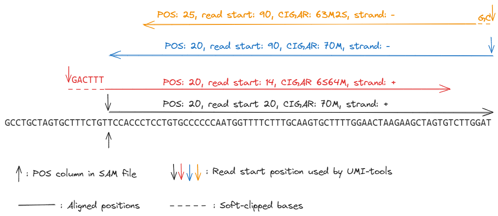

# FAQ
 - **Why is my `umi_tool group`/`dedup` command taking so long?**

	The time taken to resolve each position is dependent on how many unique UMIs there are and how closely related they are since these factors will affect how large the network of connected UMIs is. Some of the factors which can affect run time are:
   1. UMI length (shorter => fewer possible UMIs => increased connectivity between UMIs => larger networks => longer run time)
   2. Sequencing error rate (higher => more error UMIs => larger networks => longer run time)
   3. Sequencing depth (higher = greater proportion of possible UMIs observed => larger network => longer run time)
   4. Running `umi_tools dedup --output-stats` requires a considerable amount of time and memory to generate the null distributions. If you want these stats, consider obtaining stats for just a single contig, eg. `--chrom=chr22`.
   5. If you are doing single-cell RNA-seq and you have reads from more than one cell in your BAM file, make sure you are running with the `--per-cell` swtich.
&nbsp;

- **Why is my `umi_tool group`/`dedup` command taking so much memory?**

	There are a few reasons why your command could require an excessive amount of memory:
   1. Most of the above factors increasing run time can also increase memory
   2. Running `umi_tools dedup` with `chimeric-reads=use` (default) can take a large amount of memory. This is because `dedup` will wait until a whole contig has been deduplicated before re-parsing the reads from the contig and writing out the read2s which match the retained read1s. For chimeric read pairs, the read2s will not be found on the same contig and will be kept in a buffer of "orphan" read2s which may take up a lot of memory. Consider using `chimeric-reads=discard` instead to discard chimeric read pairs. Similarly, use of `--unmapped-reads=use` with `--paired` can also increase memory requirements.
&nbsp;

 - **Can I run `umi_tools` with parallel threads?**

	Not yet! This is something we have been discussing for a while (see [#203](https://github.com/CGATOxford/UMI-tools/issues/203) & [#257](https://github.com/CGATOxford/UMI-tools/issues/257)) but haven't found the time to actually implement. If you'd like to help us out, get in touch!
&nbsp;

- **What's the correct regex to use for technique X?**

	Here is a table of the techniques we have come across that are not easily processed with the basic barcode pattern syntax, and the correct regex's to use with them:

   | Technique | regex |
   | --------- | ------ |
   | inDrop    | `(?P<cell_1>.{8,12})(?P<discard_1>GAGTGATTGCTTGTGACGCCTT)(?P<cell_2>.{8})(?P<umi_1>.{6})T{3}.*` |
   | ddSeq/Sureccell | `(?P<discard_1>.{0,5})(?P<cell_1>.{6})(?P<discard_2>TAGCCATCGCATTGC){e<=1}(?P<cell_2>.{6})(?P<discard_3>TACCTCTGAGCTGAA){e<=1}(?P<cell_3>.{6})(?P<discard_4>ACG)(?P<umi_1>.{8})(?P<discard_5>GAC).*` |
   | SPLiT-seq | `(?P<umi_1>.{10})(?<cell_1>.{8})(?P<discard_1>GTGGCCGATGTTTCGCATCGGCGTACGACT)(?P<cell_2>.{8})(?<discard_2>ATCCACGTGCTTGAGAGGCCAGAGCATTCG)(?P<cell_3>.{8})` |
   | BD-Rhapsody | `(?<cell_1>.{9})(?<discard_1>.{12})(?<cell_2>.{9})(?<discard_2>.{13})(?<cell_3>.{9})(?<umi_1>.{8})T+` |

   If you know of other, please drop us a PR with them!
&nbsp;

- **Can I use `umi_tools` to determine consensus sequences?**

	Right now, you can use `umi_tools group` to identify the duplicated read groups. From this, you can then derive consensus sequences as you wish. We have discussed adding consense sequence calling as a separate `umi_tools` command (see [#203](https://github.com/CGATOxford/UMI-tools/issues/181)). If you'd like to help us out, get in touch!
&nbsp;

- **What do the `--per-gene`, `--gene-tag` and `--per-contig` options do in `umi_tools group`/`dedup`/`count`?**

	These options are designed to handle samples from sequence library protocols where fragmentation occurs post amplification, e.g CEL-Seq for single cell RNA-Seq. For such sample, mapping coordinates of duplicate reads will no longer be identical and `umi_tools` can instead use the gene to which the read is mapped. This behaviour is switched on with `--per-gene`. `umi_tools` then needs to be told if the reads are directly mapped to a transcriptome (`--per-contig`), or mapped to a genome and the transcript/gene assignment is contained in a read tag (`--gene-tag=[TAG]`). If you have assigned reads to transcripts but want to use the gene IDs to determine UMI groups, there is a further option to provide a file mapping transcript IDs to gene IDs (`--gene-transcript-map`). Finally, for single cell RNA-Seq, you must specify `--per-cell`. See `umi_tools dedup`/`group`/`count --help` for details of further related options and the [UMI-tools single cell RNA-Seq guide](https://github.com/CGATOxford/UMI-tools/blob/%7BTS%7D-AddFAQ/doc/Single_cell_tutorial.md).
&nbsp;

- **Should I use `--per-gene` with my sequencing from method X?**

	It can be difficult to work this out sometimes! So far we have come across the following technqies that require the use of `--per-gene`: CEL-seq2, SCRB-seq, 10x Chromium, inDrop, Drop-seq and SPLiT-seq. Let us know if you know of more
&nbsp;

- **How are reads/read pairs defined as having the same alignment coordinates?**
    Defining which reads have the same alignment coordinates is more difficult that one might intuitively expect. For single-end reads, `umi_tools` uses the position of the start of the read (_not the alignment start position_ - see below) and the strand. For paired-end read, `umi_tools` additionally uses the template length (this can be turned off with `--ignore-tlen`.

    When calculating the start of the read, `umi_tools` takes into account the soft-clipping and the strand of the read. Softclipped bases are part of the read, and on the forward strand UMI-tools calculates the read start position as the alignment start position minus the number of clipped bases. This is to avoid base miss-calling errors at the start of a read that could make two reads appear to have unique alignment coordinates. If the read is on the reverse strand, then the read start position is actually the alignment end position (adjust for soft-clipping). The following reads all have the same alignment start position, as defined by the "pos" column in the BAM/SAM.

   

    The black read has the same read start and alignment start. The red read has 6 bases soft-clipped at the start. While these bases don't align to the genome, and the part of the read that aligns to the genome starts at the same sequence as the black read, we take these six additional nucleotides at the start to make it unlikely that the red read is a PCR duplicate of the black read.  The blue read is on the reverse strand - while according to the SAM format specification its start position is the same as the black read, it's sequences is actually completely different, and again is unlikely to be a PCR duplicate. The orange read is also on the reverse strand. It has a different alignment start position to the blue read (perhaps due to quality trimming). It also has a different alignment end. But the last two bases are soft-clipped. If you add back on these two bases (perhaps they are sequencing errors) you find that the organe and blue reads have the same outer fragment coordinates. 

    The optimality of these choices was confirmed by looking at how well they accounted for identical UMIs of reads near each other. 

    `umi_tools` can additionally use the 'spliced' status of a read to define possible duplicates. This behaviour is turned on with the `--spliced-is-unique` option. This is obtained by inspecting the cigar string to identify `N` anywhere within the cigar (skipped regions within the reference) or, alternatively, `S` at the 3' end of the cigar (soft-clipped at the end of the read). By default, 4 bases of `S` at the 3' end is the threshold for a read to be considered spliced. This can be controlled with the `--soft-clip-threshold` option.

- **Why do I have reads with the same alignment coordinates and UMIs post deduplication?**
    It's possible for reads/read pairs with the same or very similar UMIs and seemingly the same alignment coordinates when inspecting the BAM to be put into separate UMI groups. For `umi_tools dedup`, this would mean multiple output reads which look like duplicates. Refering to the question above about how alignment coordinates are defined, an inspection of the strand, alignment start, 5' softclipping and template length (if paired end) +/- the splicing status (if `--spliced-is-unique`  has been used), will likely clarify why these reads/read pairs were not considered duplicates.

- **Has the whitelist command been peer-reviewed and compared to alternatives?**

	No. At the time of the [UMI-tools publication](http://genome.cshlp.org/content/early/2017/01/18/gr.209601.116.abstract`) on 18 Jan '17, the only tools available were `extract`, `dedup` and `group`. The `count` and `whitelist` commands were added later. With `count`, the deduplication part is identical to `dedup`, so it's reasonable to say the underlying agorithm has been peer-reviewed. However, `whitelist` is using an entirely different approach (see [here](https://github.com/CGATOxford/UMI-tools/pull/317) which has not been rigourously tested, compared to alternative algorithms or peer-reviewed. We recommend users to explore other options for whitelisting also.
&nbsp;
      
- **Can I use whitelist without UMIs?**

	Strickly speaking, yes, but only with `--extract-method string`. If you use `--extract-method regex` and don't provide both a UMI and Cell barcode position in the regex, you'll get an error.

&nbsp;
- **Can I extract barcodes from just read2?**

    Yes, you can use --read2-only with `umi_tools extract` & `whitelist`. Previously, we had been recommending users achieve this by simply swapping the read1 and read2 input files around. That's still a viable approach. 
